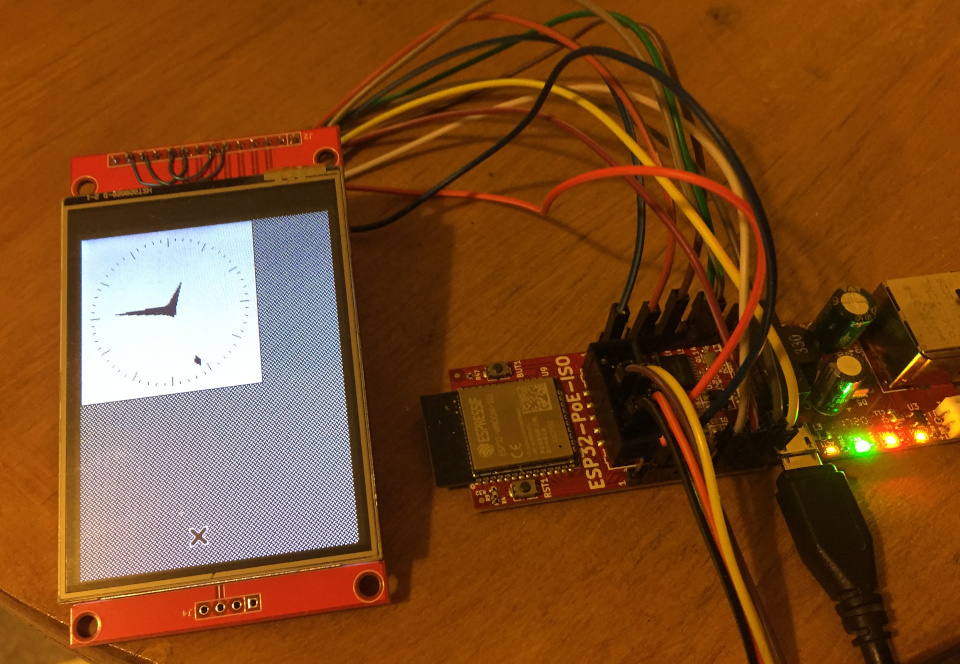

# ESPVNCC

ESP32 Vnc client

Uses ili9341 display with touch screen on the Olimex ESP POE hardware:\
https://www.olimex.com/Products/IoT/ESP32/ESP32-POE/open-source-hardware

For ESP IDF with esp-iot-solution display drivers.\
	https://github.com/espressif/esp-iot-solution

To use change #define VNC_SERVER_IPADDR in main/lcdtouchvnc.c to the IP address of your VNC server.

I tested with Xvnc version "TightVNC-1.3.10" on Linux with the command\
	"Xvnc :1 -geometry 240x320 -depth 16"

Start a clock on your display for example:\
	"xclock -update 1 -display localhost:1"

Then VNC connect to it with this code.

At the moment only "raw" encoding is supported for 16 bit RGB (565) format.

This project is not reliable at the moment, a delay is required 
ets_delay_us() before the SPI display write, otherwise the screen corrupts.
Also the code randomly locks up with "bus_lock: spi_bus_lock_acquire_end(694): 
Cannot release a lock that hasn't been acquired."  Both these issues may be
driver issues with the ESP-IDF and ESP-IOT-SOLUTION code or possibly something
unique to the hardware configuration I am using.

